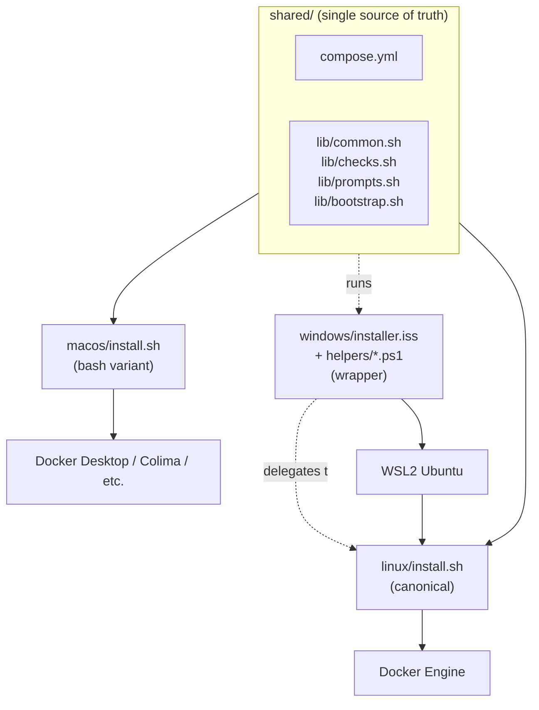
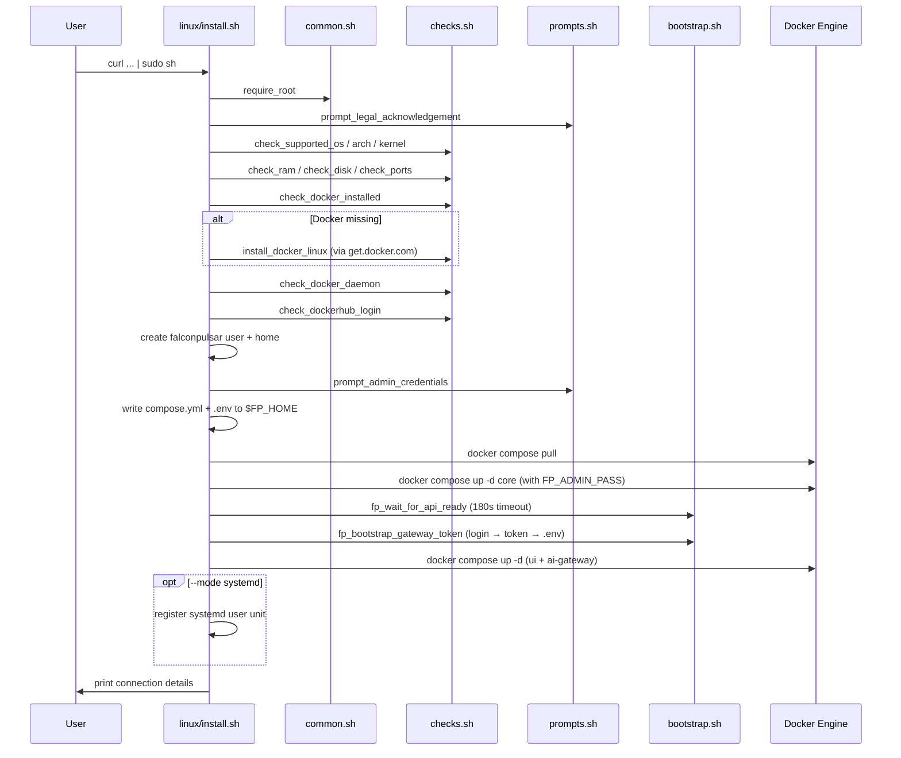
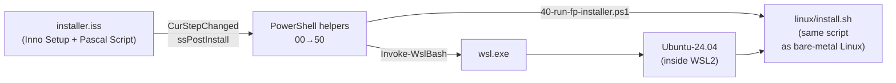

# FalconPulsar Installer — Architecture

This document is the deep reference for contributors working on the installer.
It explains **how** each installer works internally, **where** to go to change
specific behaviour, **which** environment variables flow through the system,
and **why** some of the code looks the way it does (the gotchas section is
based on real incidents — ignore it at your peril).

If you just want to use the installer, read the [README](../README.md).
If you want to make a contribution, also read [CONTRIBUTING.md](../CONTRIBUTING.md).

## Table of contents

- [The three-installer model](#the-three-installer-model)
- [Linux installer](#linux-installer)
- [macOS installer](#macos-installer)
- [Windows installer](#windows-installer)
- [Shared libraries](#shared-libraries)
- [Environment variables reference](#environment-variables-reference)
- [CI pipeline](#ci-pipeline)
- [Gotchas and non-obvious behaviour](#gotchas-and-non-obvious-behaviour)
- [Debugging tips](#debugging-tips)

---

## The three-installer model

FalconPulsar ships three installers, but **Linux is the canonical one**. macOS
is a bash variant that diverges only where the platform forces it, and Windows
is an orchestration wrapper around the Linux installer running inside WSL2.



The rules that make this work:

1. **`shared/compose.yml` is the one compose file.** All three installers
   copy it verbatim — never modify it per-platform.
2. **`shared/lib/*.sh` is sourced by both Linux and macOS.** If you add logic
   to one and not the other, they drift. Put it in `shared/lib/`.
3. **Windows does not implement install logic.** `installer.iss` and the
   PowerShell helpers only set up the environment (WSL2 + Ubuntu + systemd),
   then hand off to `linux/install.sh` running inside WSL2. A Linux bug is
   also a Windows bug, and a Linux fix is also a Windows fix.

## Linux installer

`linux/install.sh` is the reference implementation. Every concept in the
product stack — user creation, Docker install, credential bootstrap, compose
file generation, healthchecks, systemd unit registration — lives here.

### Execution flow



### Function call order (top-level)

From `linux/install.sh` main block:

1. `require_root` — refuse to run as non-root
2. `prompt_legal_acknowledgement` — Terms / Privacy / AUP / Security (skippable with `FP_LEGAL_ACCEPTED=1`)
3. `check_supported_os` — Ubuntu 22.04+, Debian 12+, RHEL 9+, Fedora 41+, openSUSE 15.6+
4. `check_arch` — x86_64 or arm64
5. `check_kernel` — ≥ 5.15 (warning only, not fatal)
6. `check_ram` — 4 GB minimum
7. `check_disk` — 10 GB free on target path
8. `check_ports` — 7433, 7434, 7435, 7436, 8080 must be free
9. `check_docker_installed` + `check_compose_v2`
10. `install_docker_linux` — via `curl https://get.docker.com | sh` if missing
11. `check_docker_daemon` — daemon is responsive
12. `check_dockerhub_login` — private image access (removed after images go public)
13. User + home directory creation → `add_user_to_docker_group`
14. `prompt_admin_credentials` → `FP_ADMIN_USER` / `FP_ADMIN_PASS`
15. Write `compose.yml` and `.env` into `/home/falconpulsar/`
16. `docker compose pull`
17. `docker compose up -d core` (first boot — seeds admin user via `FP_ADMIN_PASS`)
18. `fp_wait_for_api_ready` — loop on `/api/v1/health`
19. `fp_bootstrap_gateway_token` — create AI Gateway service token via REST
20. `docker compose up -d` — start ui and ai-gateway
21. `--mode systemd` only: write + enable systemd user unit
22. Print Web UI / REST / WebSocket URLs

### Where things live in `linux/install.sh`

| To change… | Look at |
|---|---|
| Supported distros | `shared/lib/checks.sh` — `check_supported_os` |
| Minimum RAM / disk | `shared/lib/checks.sh` — `check_ram`, `check_disk` |
| Ports checked | `shared/lib/checks.sh` — `FP_DEFAULT_PORTS` constant |
| The `falconpulsar` user creation | `linux/install.sh` — `create_falconpulsar_user` |
| Admin credential prompting | `shared/lib/prompts.sh` — `prompt_admin_credentials` |
| Compose file generation | `linux/install.sh` — `write_compose` and `write_env` |
| API key bootstrap | `shared/lib/bootstrap.sh` — `fp_bootstrap_gateway_token` |
| systemd unit template | `linux/systemd/falconpulsar.service.template` |

## macOS installer

`macos/install.sh` is a bash variant of the Linux installer. It sources the
same `shared/lib/*.sh` files and follows the same general flow, but diverges
where the platform demands it.

### Divergences from Linux

| Concern | Linux | macOS |
|---|---|---|
| Privilege | `require_root` | `require_not_root` (runs as current user) |
| Docker | Installed via `get.docker.com` | **Must be pre-installed** (Docker Desktop / Colima / OrbStack / Rancher Desktop) |
| Dedicated user | Creates `falconpulsar` system user | Uses the current user's home directory |
| Stack directory | `/home/falconpulsar/` | `~/falconpulsar/` |
| RAM minimum | 4 GB | 8 GB (Docker Desktop overhead) |
| Lifecycle | Optional systemd user unit | `restart: unless-stopped` (container engine handles it) |
| User / group IDs | `FP_UID=$(id -u falconpulsar)` | `FP_UID=$(id -u)` (current user) |

### macOS-specific functions

- `require_not_root` — refuses to run under sudo (bind-mount ownership would break)
- `detect_mac_runtime` — probes Docker Desktop, Colima, OrbStack, Rancher Desktop and reports which is installed / running

No macOS-only prompts; the interactive flow is identical to Linux.

## Windows installer

The Windows installer is the non-obvious one. Read this section before
touching anything under `windows/`.

### The handoff model

Windows is a GUI wizard (Inno Setup) that sets up WSL2 + Ubuntu, then runs
the bash Linux installer inside the WSL distro. There is **no Windows-native
install logic** — every step that actually deploys FalconPulsar is the same
code that runs on a bare-metal Ubuntu box.



### Wizard pages (`installer.iss`)

1. **Welcome** — standard Inno Setup welcome with custom subtext
2. **Legal acknowledgement** — custom Pascal page: four clickable links
   (Terms, Privacy, AUP, Security), checkbox required before Next
3. **Admin credentials** — custom `CreateInputQueryPage`: username (default
   `admin`) + password + confirm. Minimum 10 characters.
4. **Installation location** — standard page, defaults to `%PROGRAMFILES%\FalconPulsar`
5. **Finish** — postinstall checkbox to open `http://localhost:8080`

### Upgrade detection

`InitializeSetup` in the `[Code]` section checks the Inno Setup uninstall
registry key:

```
HKLM\SOFTWARE\Microsoft\Windows\CurrentVersion\Uninstall\{AppId}_is1
HKCU\SOFTWARE\Microsoft\Windows\CurrentVersion\Uninstall\{AppId}_is1
```

If present, `IsUpgrade := True` and `ShouldSkipPage` skips the legal and
credentials pages (the admin user already exists in the database). Upgrade
mode passes placeholder credentials to the PowerShell helpers, which detect
the existing `compose.yml` and just run `docker compose pull && docker compose up -d`.

Why the registry key and not `FileExists`? Because leftover files from a
partially failed previous install trigger false positives. The registry key
only gets written after a **completed** install.

### PowerShell helpers (execution order)

Called in sequence by `CurStepChanged(ssPostInstall)` via the `RunHelper`
procedure. Every helper sources `lib.ps1` first for shared logging and WSL
helpers.

| Helper | Purpose |
|---|---|
| `00-check-prereqs.ps1` | Administrator check, Windows build ≥ 19045, x64 only, VT-x / AMD-V enabled (skipped if WSL already works) |
| `10-enable-wsl.ps1` | Enable `Microsoft-Windows-Subsystem-Linux` + `VirtualMachinePlatform` Windows features, `wsl --update` the kernel, exit code 2 if reboot required |
| `20-install-distro.ps1` | `wsl --install -d Ubuntu-24.04 --no-launch` if distro not registered; write distro name to `%TEMP%\falconpulsar-distro.txt` (sentinel used by later helpers) |
| `30-configure-distro.ps1` | Write `systemd=true` to `/etc/wsl.conf` inside the distro, `wsl --terminate` to pick up the change |
| `40-run-fp-installer.ps1` | Copy `linux/` + `shared/` into `/opt/falconpulsar-installer` inside WSL (avoids 9p mount issues), verify Docker daemon, run `bash install.sh --mode docker --yes` with credentials passed via a temp env file (not argv) |
| `50-register-shortcuts.ps1` | Create Start Menu shortcuts: Open Web UI, Start/Stop/Restart/Status/Tail Logs (`wsl -d Ubuntu -- docker compose ...`), Open Stack Folder (`\\wsl.localhost\Ubuntu\home\falconpulsar`) |

### lib.ps1 (shared helpers)

- `Write-Step`, `Write-Info`, `Write-Warn`, `Write-Err`, `Stop-WithError` —
  coloured logging that **appends** to `%TEMP%\falconpulsar-install.log`
  (never overwrites; orchestrator truncates at start of run)
- `Test-Wsl2Enabled`, `Test-WslWorking` — Windows feature probes
- `Get-WslDistroVersion` — returns 1 or 2 for a named distro
- `Invoke-WslBash` — **the single correct way** to run bash inside WSL from
  PowerShell. Strips `\r` characters before passing the script (see gotcha
  #3 below).
- `ConvertTo-WslPath` — `C:\Program Files\FalconPulsar` → `/mnt/c/Program Files/FalconPulsar`

### Credentials handling

The admin password is **never** passed on the command line. The flow:

1. Inno Setup collects the password on the Credentials page
2. `installer.iss` passes it as `-AdminPass "..."` to `40-run-fp-installer.ps1`
3. The PowerShell helper writes it to a temporary env file inside WSL:
   ```bash
   ENVFILE=$(mktemp /root/fp-install.env.XXXXXX)
   trap 'rm -f "$ENVFILE"' EXIT
   cat > "$ENVFILE" <<__FP_ENV_EOF__
   export FP_ADMIN_USER='...'
   export FP_ADMIN_PASS='...'
   __FP_ENV_EOF__
   . "$ENVFILE"
   rm -f "$ENVFILE"
   bash /opt/falconpulsar-installer/linux/install.sh --mode docker --yes
   ```
4. The file is deleted in the same bash invocation, before `install.sh` runs

This avoids exposing the password via `/proc/<pid>/cmdline`, which is
world-readable to any local user.

## Shared libraries

`shared/lib/` is the heart of the installer. All four files are source-guarded
(`FP_*_SH_LOADED`) so they can be sourced from anywhere.

### `common.sh` — logging, errors, privilege, utilities

| Function | Purpose |
|---|---|
| `log_info` / `warn` / `error` / `success` / `step` / `debug` | Coloured stderr logging (respects `NO_COLOR` and TTY detection) |
| `die` | Log error + `exit 1` |
| `on_error` | `ERR` trap handler with call stack |
| `require_cmd` | Verify a command exists in `PATH` |
| `is_root` / `require_root` / `require_not_root` | Privilege checks |
| `confirm` | Yes/no prompt (auto-yes if `FP_ASSUME_YES=1`) |
| `run_as_user` | Re-exec a command as another user (via `sudo` or `su`) |
| `random_password` | 24-char URL-safe base64 password |
| `detect_os` | Returns `linux`, `macos`, `wsl`, or `unknown` |

### `checks.sh` — OS, hardware, Docker probes

| Function | Purpose |
|---|---|
| `detect_distro` | Read `/etc/os-release`, export `FP_DISTRO_ID`/`VERSION`/`LIKE` |
| `version_ge` | Compare dotted version strings |
| `check_supported_os` | Whitelist: Ubuntu 22.04+, Debian 12+, RHEL 9+, Fedora 41+, openSUSE 15.6+, macOS 14+ |
| `check_arch` | `x86_64` or `arm64` |
| `check_kernel` | ≥ 5.15 (warning only) |
| `check_systemd` | systemd ≥ 245 running (Linux `--mode systemd` only) |
| `check_ram` | 4 GB (Linux) or 8 GB (macOS / WSL) |
| `check_disk` | 10 GB free |
| `port_in_use` / `port_holder` | Test and identify port holders (`ss` / `lsof` / `netstat` fallback) |
| `check_ports` | Test `FP_DEFAULT_PORTS` = `7433 7434 7435 7436 8080` |
| `check_docker_installed` / `check_compose_v2` / `check_docker_daemon` | Docker / Compose probes |
| `check_dockerhub_login` | Verify `~/.docker/config.json` has credentials (pre-release, private images) |
| `install_docker_linux` | `curl https://get.docker.com \| sh` |
| `add_user_to_docker_group` | `usermod -aG docker` |
| `check_docker_as_user` | Test if `falconpulsar` can reach the Docker daemon |

### `prompts.sh` — interactive user input

| Function | Purpose |
|---|---|
| `prompt_legal_acknowledgement` | Show four document links, require confirmation (auto-accept via `FP_LEGAL_ACCEPTED=1`) |
| `prompt_string` | Read with default value (auto-use default if `FP_ASSUME_YES=1`) |
| `prompt_path` | Like `prompt_string` but expands `~` and checks parent directory exists |
| `prompt_password` | Read twice with no echo, minimum 10 characters |
| `prompt_admin_credentials` | Fill `FP_ADMIN_USER` (default `admin`) and `FP_ADMIN_PASS` (generate or prompt) |

### `bootstrap.sh` — first-run API bootstrap

| Function | Purpose |
|---|---|
| `fp_wait_for_api_ready` | Loop on `curl /api/v1/health` until 200 or 180 s timeout |
| `_fp_json_str` | Tiny grep-based JSON field extractor (not a real parser — avoid complex payloads) |
| `fp_bootstrap_gateway_token` | POST `/api/v1/auth/login` → JWT → POST `/api/v1/tokens` → service token for AI Gateway → append `FP_API_KEY=<token>` to `.env` (mode 0600, preserves owner) |

### `shared/compose.yml`

Three services on a single user-defined bridge network `falconpulsar`:

| Service | Image | Ports | Depends on |
|---|---|---|---|
| `core` | `falconpulsar/core:latest` | 7433 / 7434 / 7435 | — |
| `ui` | `falconpulsar/ui:latest` | 8080 | `core` (healthy) |
| `ai-gateway` | `falconpulsar/ai-gateway:latest` | 7436 | `core` (healthy) |

- The `core` service has a `bash /dev/tcp/localhost/7433` healthcheck (5 retries × 15 s interval, 90 s start period)
- All services use `user: ${FP_UID}:${FP_GID}` for bind-mount ownership
- All services are `restart: unless-stopped`
- Volumes: `${FP_DATA_DIR}:/data` bind-mount for `core` (database)

## Environment variables reference

Every `FP_*` variable the installer reads or writes. User-facing variables are
bold.

| Variable | Default | Read by | Purpose |
|---|---|---|---|
| **`FP_ADMIN_USER`** | `admin` | `prompts.sh`, `compose.yml` | Initial admin username |
| **`FP_ADMIN_PASS`** | generated or prompted | `prompts.sh`, `bootstrap.sh`, `compose.yml` | Initial admin password (first run only, never persisted) |
| `FP_API_KEY` | empty until first run | `bootstrap.sh`, `compose.yml` | AI Gateway service token (written to `.env` after bootstrap) |
| **`FP_ASSUME_YES`** | `0` | `common.sh`, `prompts.sh`, `checks.sh` | Skip all interactive prompts (CI / unattended mode) |
| **`FP_LEGAL_ACCEPTED`** | `0` | `prompts.sh` | Pre-accept legal documents (set to `1`) |
| **`FP_DEBUG`** | `0` | `common.sh`, both installers | Verbose debug logging (also via `--debug` flag) |
| `FP_HOME` | `/home/falconpulsar` or `~/falconpulsar` | both installers | Stack directory |
| `FP_USER` | `falconpulsar` | `linux/install.sh` | System user name (Linux only) |
| `FP_DATA_DIR` | `$FP_HOME/data` | both installers, `compose.yml` | Database bind-mount source |
| `FP_UID` / `FP_GID` | `id -u` / `id -g` | both installers, `compose.yml` | Container user (for bind-mount ownership) |
| `FP_REST_PORT` | `7433` | `compose.yml` | REST API port |
| `FP_WS_PORT` | `7434` | `compose.yml` | WebSocket port |
| `FP_PUBSUB_PORT` | `7435` | `compose.yml` | Pub/Sub WebSocket port |
| `FP_GATEWAY_PORT` | `7436` | `compose.yml` | AI Gateway port |
| `FP_UI_PORT` | `8080` | `compose.yml` | Web UI port |
| `FP_LOG_LEVEL` | `info` | `compose.yml` | Log level: `debug` / `info` / `warn` / `error` |
| `FP_INSTALL_MODE` | prompted | `linux/install.sh` | `docker` or `systemd` (Linux only) |
| `FP_BIND` | `0.0.0.0` | `compose.yml` | Core bind address |
| `FP_INIT_CONFIG` | unset | `compose.yml` | Path to `init.json` for schema/asset/datasource bootstrap |
| `FP_DISTRO_ID` / `_VERSION` / `_LIKE` | auto | `checks.sh` | Detected from `/etc/os-release` |
| `FP_MIN_RAM_MB_LINUX` / `_OTHER` | `4096` / `8192` | `checks.sh` | RAM thresholds |
| `FP_MIN_DISK_GB` | `10` | `checks.sh` | Disk threshold |
| `FP_DEFAULT_PORTS` | `7433 7434 7435 7436 8080` | `checks.sh` | Ports tested by `check_ports` |

**Optional third-party variables** (consumed by `ai-gateway` container, set in
`.env` after install):

- `ANTHROPIC_API_KEY` — Anthropic Claude models
- `XAI_API_KEY` — xAI Grok models

Also honoured: `NO_COLOR` (disables ANSI colours), `DOCKER_CONFIG` (alternate
Docker config path).

## CI pipeline

All workflows live in `.github/workflows/`.

| Workflow | Trigger | Purpose | Required secrets |
|---|---|---|---|
| `lint.yml` | push to `main`, PR | `shellcheck` on all bash scripts; validate `compose.yml` | — |
| `test-linux.yml` | push to `main`, PR | Smoke-test `linux/install.sh --mode docker` inside an Ubuntu 24.04 container | `DOCKERHUB_USERNAME`, `DOCKERHUB_TOKEN` (private image access) |
| `build-windows.yml` | push to `main` + `v*` tags, PR | Compile `installer.iss` to `.exe` on `windows-latest` runner (does **not** run the installer — see gotcha #5) | — |
| `release.yml` | `v*` tags only | Bundle Linux / macOS installers, compile Windows `.exe`, create GitHub Release with versioned + unversioned assets | `GITHUB_TOKEN` (automatic) |

Docs-only changes (`**/*.md`, `LICENSE`, `.gitignore`, `.editorconfig`) are
ignored by all of the above via `paths-ignore`.

## Gotchas and non-obvious behaviour

This is the section that will save future contributors hours. Every item
below is based on a real incident we debugged.

### 1. PowerShell 5.1 reads `.ps1` files as Windows-1252, not UTF-8

**Symptom:** The installer dies with `Missing closing '}'` or `string missing
terminator` errors on a file that *looks* syntactically correct in a UTF-8
editor.

**Cause:** Windows PowerShell 5.1 (which ships with all supported Windows
versions) reads scripts in the system ANSI codepage, not UTF-8. Non-ASCII
characters — em dashes (—), en dashes (–), arrows (→), box-drawing (═), curly
quotes (" ') — get misinterpreted and break the parser.

**Rule:** **All `.ps1` files must be pure 7-bit ASCII.** Use `--` instead of
em dashes, `->` instead of arrows, `=` instead of `═`. Check before committing:

```bash
perl -ne 'print "$ARGV:$.: $_" if /[^\x00-\x7F]/' windows/helpers/*.ps1
```

### 2. `ErrorActionPreference=Stop` kills scripts on `wsl.exe` non-zero exit

**Symptom:** `10-enable-wsl.ps1` or `20-install-distro.ps1` aborts with no
useful error output. Inno Setup reports the helper failed but doesn't say
why.

**Cause:** `lib.ps1` sets `$ErrorActionPreference = 'Stop'`, which is normally
what you want — any PowerShell cmdlet error stops the script. But native
executables (`wsl.exe`, `wsl --update`) can return non-zero exit codes
that PowerShell propagates as terminating errors.

**Rule:** Wrap every `wsl.exe` call that can legitimately fail (`--status`,
`--update`, `--list`) in a `try`/`catch` block, and check `$LASTEXITCODE`
explicitly. The helpers already follow this — when adding new ones, copy
the pattern from `10-enable-wsl.ps1`.

### 3. PowerShell heredocs produce CRLF; bash inside WSL chokes on `\r`

**Symptom:** Weird errors like `cp: cannot create directory
'/opt/falconpulsar-installer/'$'\r'` or `bash: /opt/...': No such file or
directory` when a path *looks* correct.

**Cause:** PowerShell heredocs (`@'...'@`) emit Windows line endings
(`\r\n`). When that string is passed to `wsl.exe -- bash -c "..."`, bash
treats `\r` as a literal character, corrupting paths and commands.

**Rule:** Always strip `\r` before passing a script to WSL. `Invoke-WslBash`
in `lib.ps1` does this automatically:

```powershell
$Script = $Script -replace "`r", ''
```

**Never call `wsl.exe -- bash -c ...` directly with a heredoc**. Always go
through `Invoke-WslBash`.

### 4. Inno Setup helpers must run at `ssPostInstall`, not `ssInstall`

**Symptom:** The PowerShell helpers can't find `helpers\lib.ps1` — Inno
reports "file not found".

**Cause:** `ssInstall` fires **before** the `[Files]` section has copied
files to the install directory. At that point `{app}\helpers\lib.ps1`
doesn't exist yet.

**Rule:** Run all helper orchestration at `ssPostInstall`. `CurStepChanged`
in `installer.iss` checks for this explicitly.

### 5. GitHub Actions Windows runners can't run WSL2

**Symptom:** Attempts to write a Windows end-to-end integration test fail
with "The attempted operation is not supported for the type of object
referenced" from `wsl --install`.

**Cause:** GitHub Actions `windows-latest` runners are Azure VMs. Nested
virtualization is **disabled**, so WSL2 (which requires the Hyper-V
hypervisor) cannot start inside them. The workflow can *compile* the `.exe`
but cannot *run* it end-to-end.

**Rule:** `build-windows.yml` compiles only. End-to-end Windows testing
requires a real Windows VM or bare-metal box. Contributors must test
Windows changes on their own machines before opening a PR.

### 6. Docker Hub rate limits anonymous pulls (and private images need auth)

**Symptom:** `test-linux.yml` fails with `toomanyrequests` or
`authentication required` when pulling `falconpulsar/core:latest`.

**Cause:** Docker Hub rate-limits anonymous pulls (100 per 6 hours per IP).
GitHub Actions runners share outbound IPs, so the limit gets hit quickly.
Additionally, FalconPulsar images are private in pre-release.

**Rule:** `test-linux.yml` logs in with `DOCKERHUB_USERNAME` /
`DOCKERHUB_TOKEN` org secrets before running the installer. When the
installer itself runs, it verifies credentials via `check_dockerhub_login`
and copies `~/.docker/config.json` into the `falconpulsar` user's home so
the stack can pull.

### 7. Passing credentials on the command line leaks them to any local user

**Symptom:** N/A — this is a pre-emptive rule, not an incident.

**Cause:** `argv` is visible via `/proc/<pid>/cmdline` to any local user.
Passing a password via `-AdminPass "..."` → `bash -c "... FP_ADMIN_PASS='...'
..."` would briefly expose the password to anyone who runs `ps` or reads
`/proc`.

**Rule:** `40-run-fp-installer.ps1` writes credentials to a temp env file
inside WSL, sources it, deletes it, then runs the bash installer. The
credentials never appear in argv.

### 8. The Windows upgrade detection must check the registry, not files

**Symptom:** Installer immediately shows "FalconPulsar is already installed,
click OK to upgrade" on a completely fresh VM.

**Cause:** A previous test run left files at `C:\Program Files\FalconPulsar\`
even though the install failed. `FileExists` returned true for `lib.ps1`, so
the wizard thought it was an upgrade.

**Rule:** `InitializeSetup` checks the Inno Setup uninstall registry key
(`HKLM\...\{AppId}_is1`), which is only written by Inno after a **completed**
install. File-based detection is unreliable.

### 9. macOS installers must run as the current user, not root

**Symptom:** Bind-mounts in `compose.yml` end up owned by `root`, and the
`core` container can't write to the database directory.

**Cause:** macOS Docker Desktop's bind-mount layer preserves the host UID.
If the installer runs as root, the database directory ends up `root:wheel`
and the container (running as `FP_UID=0`) still can't write because Docker
Desktop's VM maps `root` → a different UID inside its Linux VM.

**Rule:** `macos/install.sh` starts with `require_not_root`. The installer
is designed to run under the user's normal account, with `FP_UID=$(id -u)`.

### 10. The `falconpulsar-distro.txt` sentinel lets helpers share state

**Symptom:** When porting `20-install-distro.ps1` to support multiple
distros (Ubuntu 24.04, 22.04, Debian), later helpers couldn't know which
distro was actually installed.

**Cause:** Inno Setup runs each PowerShell helper as a **separate process**.
Variables set in one helper are not visible to the next. Inno passes command
line arguments, but those are fixed at call time.

**Rule:** `20-install-distro.ps1` writes the selected distro name to
`%TEMP%\falconpulsar-distro.txt`. Later helpers (`30-configure-distro`,
`40-run-fp-installer`, `50-register-shortcuts`) read it with a fallback
to probing WSL directly if the sentinel is missing.

## Debugging tips

### Linux

```bash
# Verbose shell trace
bash -x linux/install.sh --mode docker

# Re-run individual sections by sourcing the libs
source shared/lib/common.sh
source shared/lib/checks.sh
check_ports

# Stack logs after install
sudo -u falconpulsar docker compose -f /home/falconpulsar/compose.yml logs -f core
```

### macOS

```bash
# Tail container logs
cd ~/falconpulsar && docker compose logs -f

# Clean up fully between runs
cd ~/falconpulsar && docker compose down -v
rm -rf ~/falconpulsar
```

### Windows

1. Logs: `%TEMP%\falconpulsar-install.log` (from `lib.ps1`) and
   `%TEMP%\Setup Log YYYY-MM-DD #NNN.txt` (from Inno Setup)
2. Re-run a single helper manually:
   ```powershell
   cd "C:\Program Files\FalconPulsar\helpers"
   powershell -ExecutionPolicy Bypass -File .\40-run-fp-installer.ps1 `
       -Distro Ubuntu-24.04 `
       -InstallDir "C:\Program Files\FalconPulsar" `
       -AdminUser admin `
       -AdminPass 'your-password'
   ```
3. Inspect the distro from Windows:
   ```powershell
   wsl -d Ubuntu-24.04 -u root -- bash
   # inside:
   ps -p 1 -o comm=        # should print 'systemd'
   docker ps
   cat /home/falconpulsar/compose.yml
   cat /opt/falconpulsar-installer/linux/install.sh
   ```
4. Nuke and retry from scratch:
   ```powershell
   wsl --unregister Ubuntu-24.04
   Remove-Item "C:\Program Files\FalconPulsar" -Recurse -Force
   # then re-run FalconPulsar-Setup.exe
   ```
